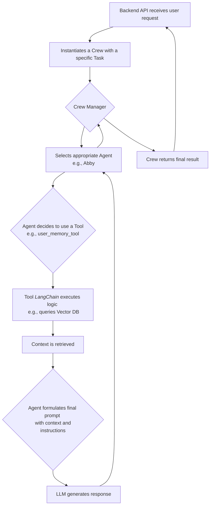

```mermaid
flowchart TD
    A[Backend API receives user request] --> B[Instantiates a Crew with a specific Task];
    B --> C{Crew Manager};
    C --> D[Selects appropriate Agent <br/> e.g., Abby];
    D --> E{Agent decides to use a Tool <br/> e.g., user_memory_tool};
    E --> F[Tool <i>LangChain</i> executes logic <br/> e.g., queries Vector DB];
    F --> G[Context is retrieved];
    G --> H{Agent formulates final prompt <br/> with context and instructions};
    H --> I[LLM generates response];
    I --> D;
    D --> C;
    C --> J[Crew returns final result];
    J --> A;
```
