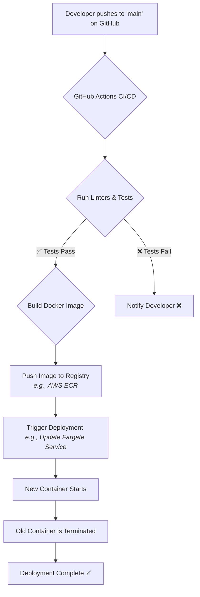

```mermaid
flowchart TD
    A[Developer pushes to 'main' on GitHub] --> B{GitHub Actions CI/CD};
    B --> C{Run Linters & Tests};
    C -- ✅ Tests Pass --> D{Build Docker Image};
    D --> E[Push Image to Registry <br/><i>e.g., AWS ECR</i>];
    E --> F[Trigger Deployment <br/><i>e.g., Update Fargate Service</i>];
    F --> G[New Container Starts];
    G --> H[Old Container is Terminated];
    H --> I[Deployment Complete ✅];
    C -- ❌ Tests Fail --> J[Notify Developer ❌];
```
