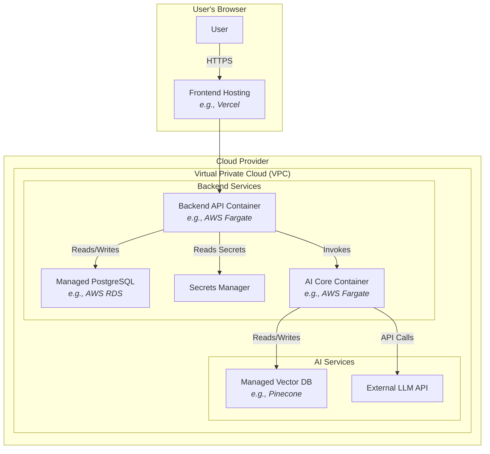

```mermaid
graph TD
    subgraph "User's Browser"
        User -- HTTPS --> Frontend
    end

    subgraph "Cloud Provider"
        subgraph "Virtual Private Cloud (VPC)"
            Frontend[Frontend Hosting <br/><i>e.g., Vercel</i>] --> Backend[Backend API Container <br/><i>e.g., AWS Fargate</i>]
            
            subgraph "Backend Services"
                Backend --"Reads/Writes"--> PG[Managed PostgreSQL <br/><i>e.g., AWS RDS</i>]
                Backend --"Reads Secrets"--> Secrets[Secrets Manager]
                Backend --"Invokes"--> AICore[AI Core Container <br/><i>e.g., AWS Fargate</i>]
            end

            subgraph "AI Services"
                AICore --"Reads/Writes"--> VDB[Managed Vector DB <br/><i>e.g., Pinecone</i>]
                AICore --"API Calls"--> LLM_API[External LLM API]
            end
        end
    end
```
