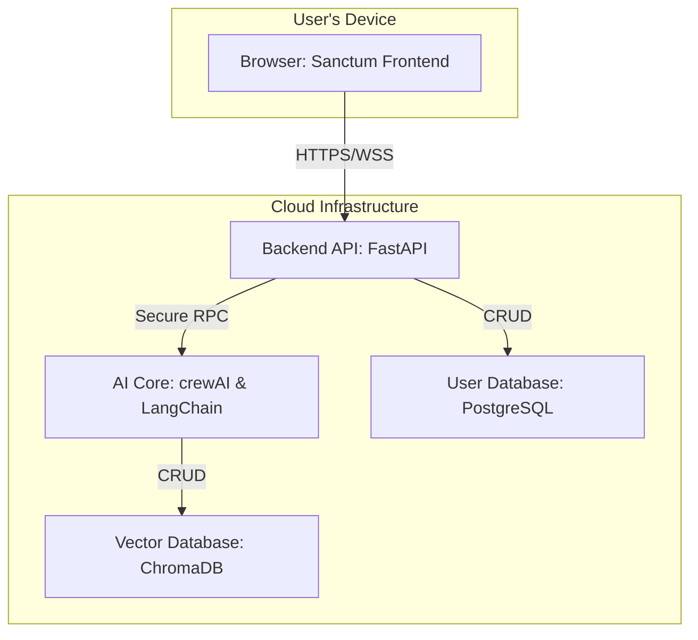

```mermaid
  graph TD
      subgraph "User's Device"
          A[Browser: Sanctum Frontend]
      end
  
      subgraph "Cloud Infrastructure"
          B[Backend API: FastAPI]
          C[AI Core: crewAI & LangChain]
          D[User Database: PostgreSQL]
          E[Vector Database: ChromaDB]
      end
  
      A -- HTTPS/WSS --> B
      B -- Secure RPC --> C
      B -- CRUD --> D
      C -- CRUD --> E
```
