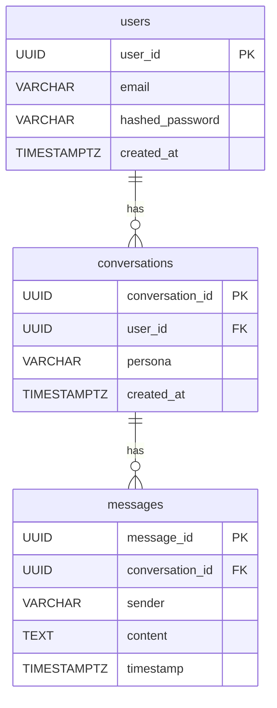

```mermaid
erDiagram
    users {
        UUID user_id PK
        VARCHAR email
        VARCHAR hashed_password
        TIMESTAMPTZ created_at
    }
    conversations {
        UUID conversation_id PK
        UUID user_id FK
        VARCHAR persona
        TIMESTAMPTZ created_at
    }
    messages {
        UUID message_id PK
        UUID conversation_id FK
        VARCHAR sender
        TEXT content
        TIMESTAMPTZ timestamp
    }

    users ||--o{ conversations : "has"
    conversations ||--o{ messages : "has"
```
