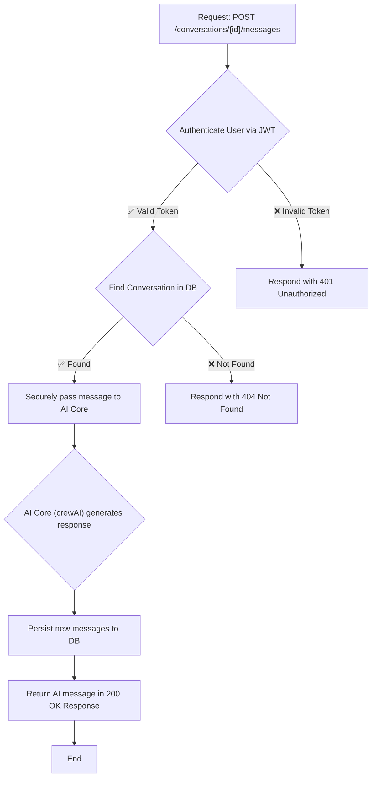

```mermaid
flowchart TD
    A["Request: POST /conversations/{id}/messages"] --> B{Authenticate User via JWT};
    B -- ✅ Valid Token --> C{Find Conversation in DB};
    C -- ✅ Found --> D[Securely pass message to AI Core];
    D --> E{"AI Core (crewAI) generates response"};
    E --> F[Persist new messages to DB];
    F --> G[Return AI message in 200 OK Response];
    G --> H[End];

    B -- ❌ Invalid Token --> I[Respond with 401 Unauthorized];
    C -- ❌ Not Found --> J[Respond with 404 Not Found];
```
