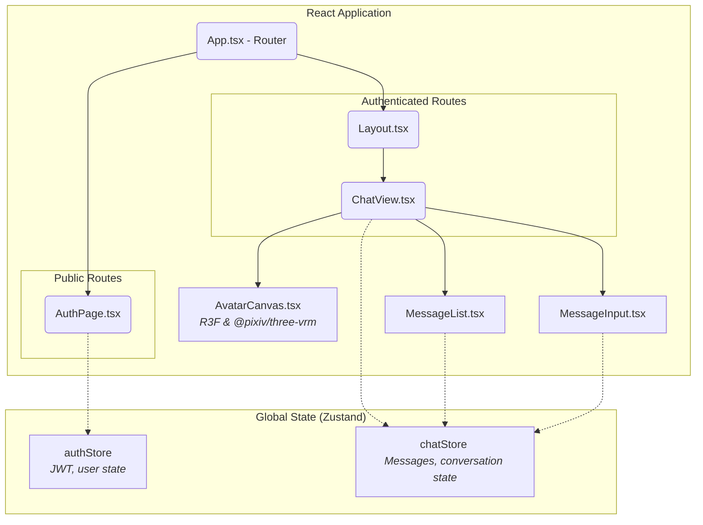

```mermaid
graph TD
    subgraph "React Application"
        App(App.tsx - Router)

        subgraph "Authenticated Routes"
            Layout(Layout.tsx) --> ChatView(ChatView.tsx)
        end
        
        subgraph "Public Routes"
            AuthPage(AuthPage.tsx)
        end

        ChatView --> AvatarCanvas[AvatarCanvas.tsx <br/><i>R3F & @pixiv/three-vrm</i>]
        ChatView --> MessageList[MessageList.tsx]
        ChatView --> MessageInput[MessageInput.tsx]
        
        App --> Layout
        App --> AuthPage
    end

    subgraph "Global State (Zustand)"
        authStore[authStore <br/><i>JWT, user state</i>]
        chatStore[chatStore <br/><i>Messages, conversation state</i>]
    end

    AuthPage -.-> authStore
    ChatView -.-> chatStore
    MessageList -.-> chatStore
    MessageInput -.-> chatStore
```
