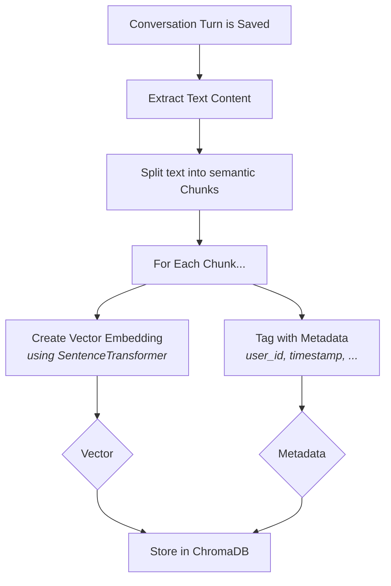

```mermaid
flowchart TD
    A[Conversation Turn is Saved] --> B[Extract Text Content];
    B --> C[Split text into semantic Chunks];
    C --> D[For Each Chunk...];
    D --> E[Create Vector Embedding <br/> <i>using SentenceTransformer</i>];
    D --> F[Tag with Metadata <br/> <i>user_id, timestamp, ...</i>];
    E --> G{Vector};
    F --> H{Metadata};
    G & H --> I[Store in ChromaDB];
```
