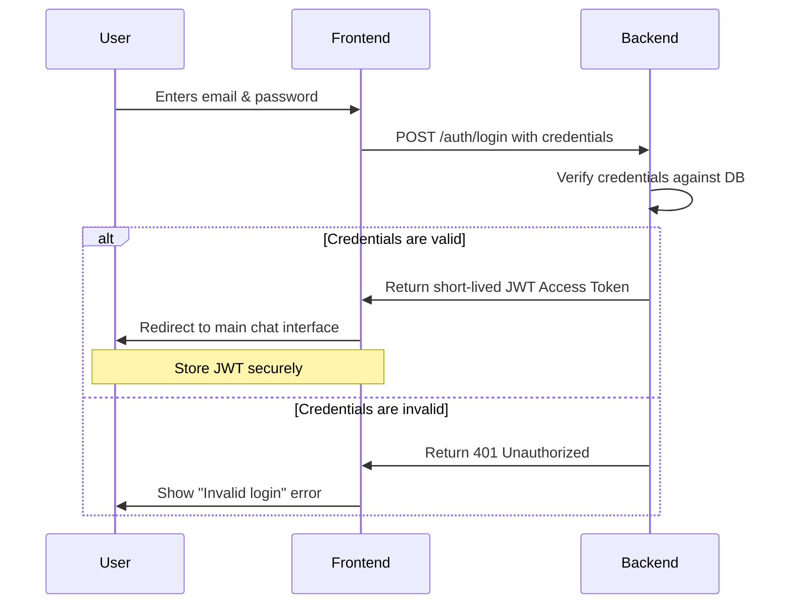

```mermaid
sequenceDiagram
    participant User
    participant Frontend
    participant Backend

    User->>Frontend: Enters email & password
    Frontend->>Backend: POST /auth/login with credentials
    Backend->>Backend: Verify credentials against DB
    alt Credentials are valid
        Backend->>Frontend: Return short-lived JWT Access Token
        Frontend->>User: Redirect to main chat interface
        Note over Frontend,User: Store JWT securely
    else Credentials are invalid
        Backend->>Frontend: Return 401 Unauthorized
        Frontend->>User: Show "Invalid login" error
    end
```
