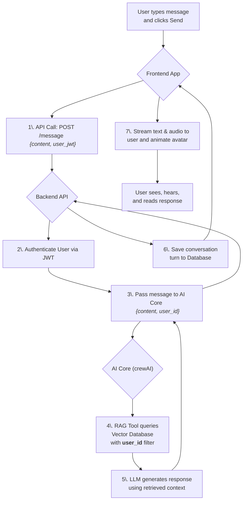

```mermaid 
 flowchart TD
      A["User types message <br> and clicks Send"] --> B{Frontend App};
      B --> C["1\. API Call: POST /message <br> <em>{content, user_jwt}</em>"];
      C --> D{Backend API};
      D --> E["2\. Authenticate User via JWT"];
      E --> F["3\. Pass message to AI Core <br> <em>{content, user_id}</em>"];
      F --> G{"AI Core (crewAI)"};
      G --> H["4\. RAG Tool queries <br> Vector Database <br> with <b>user_id</b> filter"];
      H --> I["5\. LLM generates response <br> using retrieved context"];
      I --> F;
      F --> D;
      D --> J["6\. Save conversation <br>turn to Database"];
      J --> B;
      B --> K["7\. Stream text & audio to <br>user and animate avatar"];
      K --> L["User sees, hears, <br> and reads response"];
```
